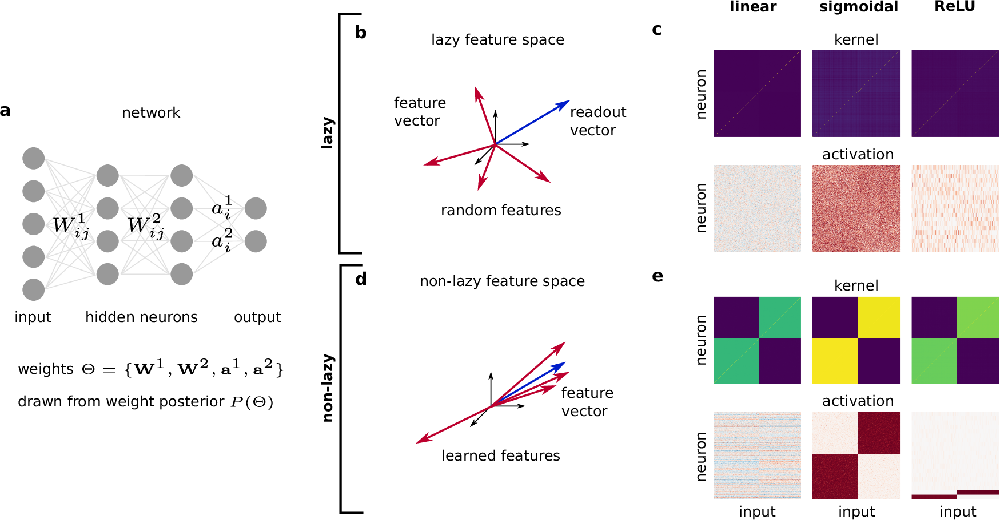
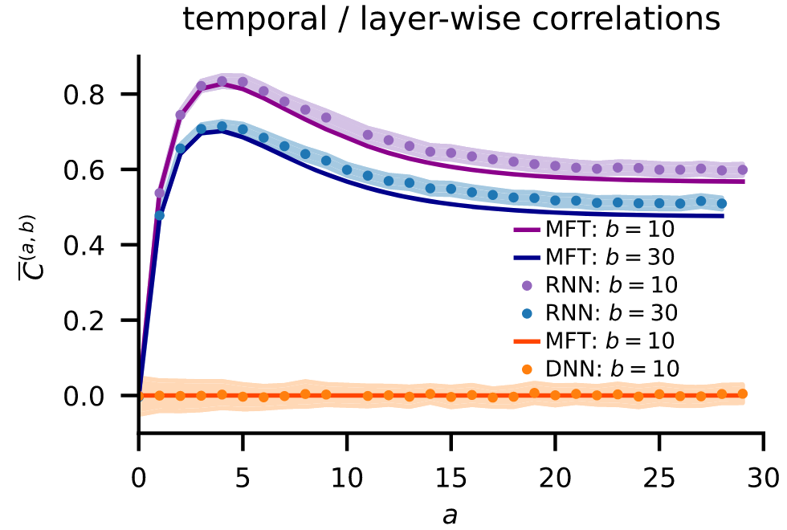
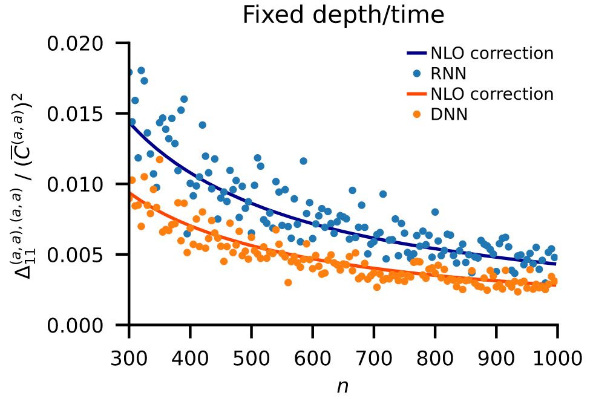

Fundamental questions regarding artificial neural networks remain wide open: How do the networks learn useful representations based on the data and the task? Why do these representations generalize beyond the training task? And how is this implemented on the neuronal level? Getting reliable answers to these questions is hard because training artificial neural network is complex---there are many moving parts, from obvious ones like the network architecture to more subtle ones like initialization or step-size. And all of these parts can have a profound impact on the trained networks.

Working in a Bayesian perspective allows to circumvent all difficulties related to the training process and to focus on the trained networks, i.e., networks sampled from the Bayes posterior. For this reason, Bayesian neural networks are a promising starting point to address fundamental questions about learning in artificial neural networks. The central challenge is to understand the structure of the Bayes posterior, which mirrors the central problem in Statistical Mechanics: understanding the structure of the Gibbs distribution. Accordingly, the rich toolset of Statistical Mechanics is readily applicable to Bayesian neural networks.

<!--more-->

### Table of Contents
{:.no_toc}
* this unordered seed list will be replaced by toc as unordered list
{:toc}

#### Coding Schemes in Neural Networks Learning Classification Tasks

* **Publication**: A. van Meegen and H. Sompolinsky, [Nature Communications **16**, 3354 (2025)](https://www.nature.com/articles/s41467-025-58276-6)
* **Poster**: *Bernstein 2025*, Frankfurt a. M., Germany ([pdf](../assets/pdf/Bernstein25_codingschemes.pdf))

This work addresses one central question: what is the structure of learned representations in artificial neural networks? To this end, we developed a theory of the Bayes posterior deep in the feature learning regime, where the network weights are significantly changed by learning. Although the theory applies to arbitrary supervised tasks, we focused on classification tasks because they impose a clear structure. Indeed, this structure is mirrored in the learned representations via "coding schemes" where neurons show category selectivity: they become active for specific subsets of classes.

A very surprising result was the profound impact of the neuronal non-linearity, which leads to fundamentally different coding schemes: analog coding schemes for linear networks, redundant coding schemes for sigmoidal networks, and sparse coding schemes for ReLU networks. This variety is explained in our theory by the structure of the posterior. From a technical point of view, the main challenge was that the feature learning regime is deeply non-Gaussian; the key to address this challenge was to identify appropriate order parameters.

#### Unified Field Theoretical Approach to Deep and Recurrent Neuronal Networks

* **Publication**: K. Segadlo*, B. Epping*, A. van Meegen*, D. Dahmen, M. Krämer, and M. Helias, [J. Stat. Mech., 103401 (2022)](https://iopscience.iop.org/article/10.1088/1742-5468/ac8e57)

Feedforward and recurrent neuronal networks differ fundamentally due to weight sharing: recurrent networks employ the same weights in every time step while feedforward networks use a new set of weights in every layer. How does this difference affect the mapping from inputs to outputs?

To be able to compare the two network architectures, we developed a unified description based on tools from statistical field theory. We start the comparison in the infinite width / size limit. Already to leading order differences emerge: weight sharing leads to correlations between time steps in recurrent networks. Curiously, these correlations do not affect the prediction if it is based on a single time point.

To uncover differences relevant for the prediction, we calculated finite-size corrections. These next-to-leading-order corrections reveal a clear difference between the architectures: weight sharing in recurrent networks allows fluctuations to build up, leading to larger overall corrections.
