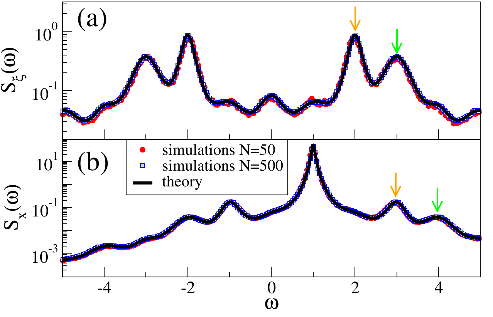

## Table of Contents
{:.no_toc}
* this unordered seed list will be replaced by toc as unordered list
{:toc}

See also my [Google Scholar page](https://scholar.google.de/citations?user=2HpXCQ0AAAAJ).

## Dynamics of Random Networks

The structure of cortical networks of mammals is only known on a statistical level. Thus, they are typically modeled as random networks with the appropriate connectivity statistics. Conveniently, quite a bit about the dynamics of random networks can be deduced using tools from statistical physics.

Indeed, for random networks, one can start from the N-dimensional, coupled system of differential equations which describe the dynamics of the network and arrive, through a series of systematic approximations, at an effective lower-dimensional description. This approach, called Dynamic Mean-Field Theory (DMFT) in the pioneering work by [Sompolinsky, Crisanti, and Sommers](https://journals.aps.org/prl/abstract/10.1103/PhysRevLett.61.259), relies heavily on techniques from field theory (see the lecture notes [Helias & Dahmen 2020](https://www.springer.com/de/book/9783030464431) for an introduction). Albeit mathematically involved, the final result is intuitive: the recurrent input to a neuron is approximated as a Gaussian process with self-consistent statistics.

#### Large-Deviation Approach to Random Recurrent Neuronal Networks: Parameter Inference and Fluctuation-Induced Transitions

* **Publication**: A. van Meegen, T. Kühn, and M. Helias, [Phys. Rev. Lett. **127**, 158302 (2021)](https://journals.aps.org/prl/abstract/10.1103/PhysRevLett.127.158302)
* **Poster**: *COSYNE 2020*, Denver, United States ([pdf](pdf/COSYNE20_pathdeviation.pdf))

A particular realization of a random network leads, through its dynamics, to particular network-averaged observables (think correlation functions). Hence, the ensemble of random networks gives rise to a distribution of observables. We calculated the latter distribution to leading order using field theory and large deviations theory, building on the pioneering work of [Ben-Arous and Guionnet](https://link.springer.com/article/10.1007/BF01198846).

With the distribution of observables at hand, we attacked the inverse problem of determining the statistics of the random network from its dynamics. From this point of view, the distribution is the likelihood of the connectivity statistics. Employing maximum likelihood enabled us to infer the connectivity statistics directly from network-averaged power spectra.

Complementary, the distribution of observables also enabled progress on the forward problem: The maximum of the distribution corresponds to DMFT;  we used the variability about this maximum to calculate beyond-mean-field fluctuations. This lead us to a novel network state featuring two stable mean-field solutions and fluctuation-induced transitions between them.

#### Self-Consistent Correlations of Randomly Coupled Rotators in the Asynchronous State

* **Publication**: A. van Meegen and B. Lindner, [Phys. Rev. Lett. **121**, 258302 (2018)](https://journals.aps.org/prl/abstract/10.1103/PhysRevLett.121.258302)
* **Talk**: *CNS 2019 Main Meeting*, Barcelona, Spain ([pdf](pdf/CNS19_rotators.pdf))

The dynamics of cortical networks in awake, behaving animals are typically asynchronous and irregular. We set out to find a toy model that features such an network state but is still analytically tractable. To this end, we investigated a random network of oscillatory units (rotators).

Using DMFT, we derived an ordinary differential equation determining the network-averaged correlation function. For simple interaction functions, this differential equation could be solved explicitly, leading to closed-form analytical expressions for the correlation functions and power spectra.

Deep in the mean-driven regime, spiking neurons behave similar to oscillators. Thus, we extended our theory to mimic the spike-based coupling of cortical neurons. This allowed us to determine the power spectra of a sparse, heterogeneous network of excitatory and inhibitory exponential integrate-and-fire neurons deep in the mean-driven regime.

#### Microscopic Theory of Intrinsic Timescales in Spiking Neural Networks

* **Publication**: A. van Meegen and S.J. van Albada, [Phys. Rev. Research **3**, 043077 (2021)](https://journals.aps.org/prresearch/abstract/10.1103/PhysRevResearch.3.043077)
* **Poster**: *CNS 2019*, Barcelona, Spain ([pdf](pdf/CNS19_timescales.pdf))

<!-- ## Large-Scale Simulations -->
